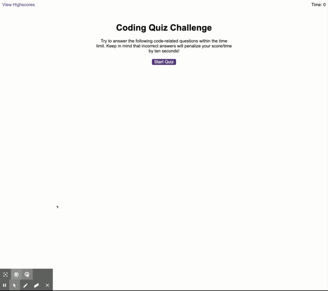

# JavaScript: Code Quiz

This is a code quiz to test basic elements of JavaScript.

## Description

This timed quiz includes a series of multiple choice questions.  You will be given 15 per question total.  At the end of the quiz you will have an opportunity to log your score.

## Directions

1. Go to [code-quiz](https://wilmararturo.github.io/code-quiz/)
2. Click "Start Quiz" 
3. Answer the questions.  Each wrong answer will deduct ten seconds from the time remaining.

## Scoring

You score is equal to the time remaining at the end of the quiz.

